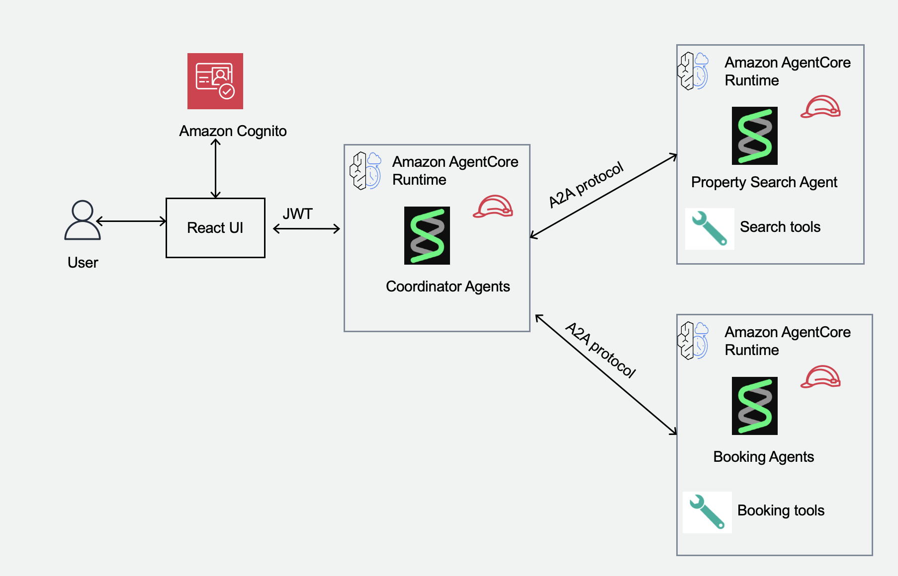

# A2A Real Estate AgentCore Multi-Agents

A sample AI-powered real estate platform built with Amazon Bedrock AgentCore, featuring multi-agent coordination using the A2A (Agent-to-Agent) protocol with OAuth 2.0 authentication.

## 🎬 Demo


*AI-powered property search and booking using multi-agent coordination with A2A protocol*

## 🏗️ Architecture

This system demonstrates a multi-agent architecture with direct UI-to-agent communication:



### Key Features

- **Multi-Agent Coordination**: Coordinator agent orchestrates specialized agents
- **A2A Protocol**: Industry-standard agent-to-agent communication
- **OAuth 2.0 Security**: Secure authentication using Amazon Cognito
- **Professional UI**: Modern React TypeScript interface
- **Real-time Communication**: Async message handling with streaming support
- **Serverless Deployment**: Deployed on Amazon Bedrock AgentCore serverless runtime

## 📋 Prerequisites

- **Python 3.8+**
- **Node.js 16+** and npm
- **AWS Account** with appropriate permissions
- **AWS CLI** configured with credentials
- **Amazon AgentCore CLI** installed (`pip install bedrock-agentcore-cli`)

## 🚀 Quick Start

### 1. Deploy the Agents

```bash
# Clone the repository
cd A2A-realestate-agentcore-multiagents

# Set up Cognito for OAuth
python setup_cognito_automated.py

# Deploy all agents with OAuth
python deploy_agents_with_oauth.py
```

This will:
- Create a Cognito User Pool with OAuth 2.0 client credentials flow
- Generate `.bedrock_agentcore.yaml` configuration files for each agent
- Deploy **Property Search Agent** to AgentCore
- Deploy **Property Booking Agent** to AgentCore
- Configure **Coordinator Agent** with sub-agent runtime URLs as environment variables
- Deploy **Real Estate Coordinator Agent** to AgentCore
- Configure OAuth authentication for all agents
- Save deployment info to `deployment_info.json` with runtime URLs

**Note:** The deployment script automatically passes the runtime URLs of the search and booking agents to the coordinator as environment variables during deployment using the `--env` flag.

### 2. Start the React UI

```bash
./start-ui.sh
```

The script will:
- Generate fresh OAuth token
- Create UI configuration with agent ARNs
- Install dependencies (first time only)
- Start React development server
- Open browser at `http://localhost:3000`

**Note:** The UI connects directly to your deployed agents in AWS. No backend server needed!

## 💻 Using the Application

### Web Interface

1. Open `http://localhost:3000` in your browser
2. You'll see a chat interface with the Real Estate Coordinator
3. Try these example queries:

   - "Find apartments in New York under $4000"
   - "Show me 2-bedroom houses in Seattle"
   - "Search for luxury properties in San Francisco"
   - "Book property PROP001 for John Doe, email john@example.com, phone 555-1234, move-in 2025-12-01"
   - "Check my booking status"

### Quick Action Buttons

The UI provides quick action buttons for common queries:
- Find apartments in New York under $4000
- Show me 2-bedroom houses in Seattle
- Search for luxury properties in San Francisco
- List all available bookings

### Features

- **Real-time Chat**: Instant responses from the AI coordinator
- **Markdown Support**: Rich text formatting in responses
- **Connection Status**: Visual indicator of backend connectivity
- **Responsive Design**: Works on desktop, tablet, and mobile
- **Loading Indicators**: Visual feedback during agent processing

## 🧪 Testing

### Test the Coordinator Agent

```bash
# Quick test with OAuth
python test_coordinator_quick.py


## 🔧 Configuration

### Environment Files

The project uses several configuration files that are **auto-generated** and **excluded from Git** for security:

#### 1. `.env` (Root directory)
Created by `setup_cognito_automated.py`. Contains OAuth credentials:
```bash
COGNITO_USER_POOL_ID=your-user-pool-id
COGNITO_CLIENT_ID=your-client-id
COGNITO_CLIENT_SECRET=your-client-secret  # SENSITIVE!
COGNITO_DISCOVERY_URL=https://cognito-idp...
AWS_REGION=us-east-1
```
⚠️ **Never commit this file!** It contains your client secret.

#### 2. `ui/.env.local` (UI directory)
Created by `start-ui.sh`. Contains UI configuration:
```bash
REACT_APP_BEARER_TOKEN=your-oauth-token  # SENSITIVE!
REACT_APP_COORDINATOR_AGENT_ARN=arn:aws:bedrock-agentcore:...
REACT_APP_API_MODE=direct
```
⚠️ **Never commit this file!** It contains your OAuth token.

#### 3. `deployment_info.json`
Created by `deploy_agents_with_oauth.py`. Contains deployment details:
```json
{
  "cognito_config": {
    "user_pool_id": "us-east-1_XXXXXXXXX",
    "client_id": "xxxxxxxxxxxxxxxxxxxx",
    "discovery_url": "https://cognito-idp.us-east-1.amazonaws.com/..."
  },
  "agents": [...]
}
```
⚠️ **Excluded from Git** - Contains account-specific information.

#### 4. `.bedrock_agentcore.yaml` (Each agent directory)
Created by `deploy_agents_with_oauth.py`. Contains AgentCore configuration.
⚠️ **Excluded from Git** - Contains account-specific settings.

### Template Files

- `.env.example` - Template for .env file
- `.bedrock_agentcore.yaml.example` - Template for AgentCore config
- `ui/.env.local` is generated automatically, no template needed

## 🔐 Security

### Authentication & Authorization
- **OAuth 2.0**: Client credentials flow for machine-to-machine auth
- **JWT Tokens**: Signed tokens with 60-minute expiration
- **Automatic Token Generation**: Fresh tokens generated on each UI start
- **No Credentials in Code**: All secrets fetched from AWS at runtime


## 🐛 Troubleshooting

### UI won't start

```bash
# Check AWS credentials
aws sts get-caller-identity

# Verify deployment
cat deployment_info.json

# Regenerate UI configuration
python generate_ui_config.py
```

### UI can't connect to agents

```bash
# Check if .env.local exists
cat ui/.env.local

# Verify token is valid
python get_fresh_token.py

# Restart UI
./start-ui.sh
```

### OAuth token expired

Tokens expire after 60 minutes. Regenerate and restart UI:

```bash
python get_fresh_token.py
./start-ui.sh
```


## Authors

- **Mitul Patel** - Sr. Specialist Solutions Architect (Generative AI), AWS
- **Ramprasath S** - Senior Applied AI Architect, AWS

